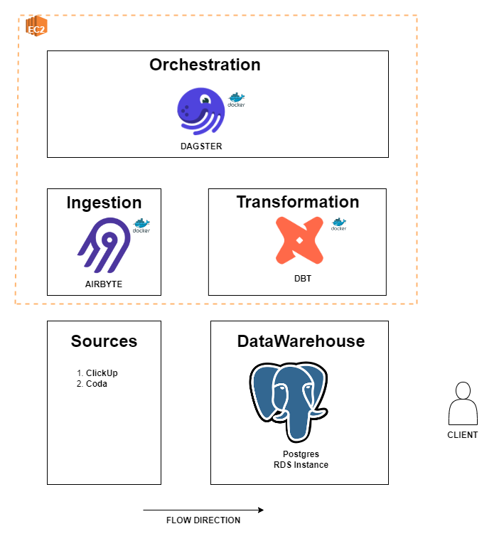

# KELIHI DATA PLATFORM

This repository aims to deploy a Modern Data Stack with Airbyte-Dagster-DBT containerized.
**SO FAR WE ARE DEPLOYING DAGSTER AND DBT FIRST.**



## DAGSTER
To understand Dagster deployment complexity, please visit [Open Source Deployment](https://docs.dagster.io/deployment/overview)

## DBT
DBT Project is being deployed at the same dagster_user_code container, this solution come up after facing problems trying to deploy a unique dbt container via deprecated [dbt-rpc](https://docs.getdbt.com/reference/commands/rpc)

## IMPROVEMENTS

 - Separate DBT from Dagster and use the new [dbt-server](https://github.com/dbt-labs/dbt-server)
 - Implement Airbyte on deployment

## DEVELOPER GUIDE

**CLONE REPOSITORY**
```bash
git clone 
```

 **SETUP VIRTUAL ENVIRONMENT**
```bash
python -m venv venv
```
```bash
source venv/bin/activate
```

**INSTALL DEPENDENCIES**
```bash
pip install -r requirements.txt
```

**INITIALIZING DOCKER**
```bash
docker compose build
```
```bash
docker compose up
```

 **OBS: Dagster Webserver UI is accessible through port 3000 (localhost:3000)**